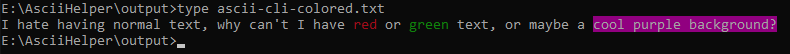
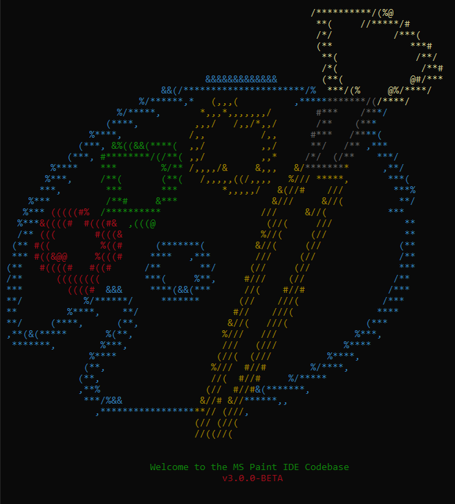
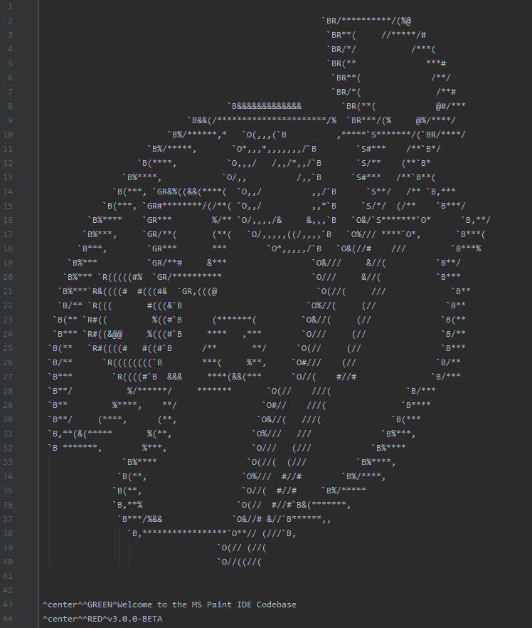

# BatchHelper

BatchHelper is a simple program I wrote after writing just docs for 2 days straight and I needed something to help keep my sanity. This is meant to make stylizing Batch ASCII art and any other colored text.

An example of this is say you have an input string such as:

```
I hate having normal text, why can't I have red or green text, or maybe a cool purple background?
```

In console this is quite boring, and I'm not even going to show a picture of what it outputs. To add colors, you need to manually add some non-standard characters, along with identifying numbers which can be extremely hard to maintain.

Before conversion with BatchHelper, that same string can be:

```
I hate having normal text, why can't I have ^RED^red ^RESET^or ^GREEN^green ^RESET^text, or maybe a ^STRONG_BACK_MAGENTA^cool purple background?
```

After conversion, the following will be the result (Some characters may not be visible due to the weird-ass characters:

```
I hate having normal text, why can't I have red or green text, or maybe a cool purple background?
```

When echoed to console, this is what it looks like:




# Usage

This isn't really made for end-users, it's more of an in-development tool kind of thing. Input text can be made by adding `^COLOR^` where `COLOR` is a value from the `com.uddernetworks.batchhelper.Color` enum. The program can **also** center a line with the rest of the formatted content, by adding `^center^` to the beginning of a line.

Custom shorthands may also be added by changing the map in `BatchHelper.java`, called `COLOR_SHORTHANDS`. It's pretty straightforward on how it works, only that it replaces the key (By default something like ``S`) with the color, so no `^` are needed. This is helpful when a lot of colors are required in a line, for things like ASCII art to help preserve the text while editing and make adding colors faster.

The two variables at the top `USE_FILE` and `RUN_DEMO` are the only other things you may want to change in the code. `USE_FILE`, when true, will read from the file `input/input.txt` and will output the converted data to `output/ascii-colored.txt`. When false, the input must be sent to System.in through console, and will continue when a newline is sent. The output data is saved to `output/ascii-cli-colored.txt`.

When `RUN_DEMO` is true, it will run a batch file to echo the converted string to show what it will look like.

# A Bigger Example

This program was originally just made to stylize the logo for [MS Paint IDE](https://github.com/MSPaintIDE/MSPaintIDE) when setting up the codebase locally. This is the default text from [input/input.txt](https://github.com/RubbaBoy/BatchHelper/blob/master/input/input.txt).

This bigger example featuring shorthands, normal coloring, and centering is:



The following is a screenshot of the input file the above image was generated from:

